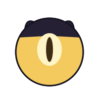

# Lune

> **L**ogic **U**sing **N**ode **E**ngine

A client-side automation mod for Minecraft. Wire a job together out of nodes, press play, and go
do something else — Lune walks, digs, fights and crafts on her own (and sometimes can even clutch a
fall: a water bucket if she has one, a boat while the drop is still slow, or a hay bale under the
landing when it is not).

Built for **NeoForge** (primary) and **Fabric**, sharing one module that holds essentially all the
logic.

---

## Meet Lune



Lune is the little floating soul who lives in the control panel. She follows you in her little comfortable interface and helps with the tasks you create together.

She is more than decoration. Lune shows the current job and its progress, celebrates milestones,
and notices when the bot is thinking, working, waiting, blocked, in danger, successful, out of
inventory space, missing materials, or paused by the player.

In the Tasks tab she may suggest practical improvements, such as setting a sensible target for
a large gathering job or preparing tools and supplies. Every change is previewed first and only
happens after you accept it. Suggestions can be postponed, muted for one task, muted by type,
or restored later from Config. Lune can also be made quieter, put to sleep, resized, or hidden
entirely.

That logo is the same layered design used in the interface: dark shell, animated golden soul, and
one watchful eye.

<br clear="left">

---

## Requirements

| | |
| --- | --- |
| Minecraft | 26.1.2 |
| Java | 25 |
| Loader | NeoForge, or Fabric with Fabric API |

Client-side only — the server never sees it. **Most multiplayer servers ban automation.** Check the
rules where you play, and keep backups: this thing digs, and it will happily dig somewhere you did
not want a hole.

## Keys

| Key | Action |
| --- | --- |
| `J` | Open the control panel |
| `K` | Pause / resume |
| `Shift+K` | Stop everything, now |
| `F6` | Debug overlay |

## The panel

- **Main** — what the bot is doing right now, plus Pause / Clear / Stop.
- **Task** — the node editor. This is where the work happens.
- **Config** — movement, safety limits, debug, learning, and advanced world access.
- **Waypoints** — named places. Leave the box blank to save where you stand. In single-player,
  they are stored inside that world's `lune/` folder, so moving or copying the world keeps its
  waypoints while another world cannot accidentally use them. Multiplayer waypoints are isolated
  by server address.

The optional omniscient mining and harvesting settings are available only in a single-player world
(including a world opened to LAN) or to a player with the server's vanilla operator permission. On
other multiplayer accounts they are locked and runtime behavior remains human-vision only, even if
the local config file was edited by hand.

## Task

A task is a graph of independently powered circuits made of nodes. Each node is one command; each
command reports success or failure when it finishes, and that outcome *is* the branch — there is no
separate condition language to learn.

- Nodes with nothing wired to them just run in order.
- An **Always** source is an independent pulse source, so it does not need a separate START node.
  It sends a new signal continuously by default, or at its selected interval; each pulse is its
  own circuit. For tasks without Always, Lune adds the general **START** node
  by default; connect its Success pin to the first action. START sends that signal once.
- Green **Success** and red **Fail** pins send the run somewhere else.
- An edge pointing back at an earlier node is a loop.
- The amber **While** pin keeps its connected companion circuit active for as long as the main
  node is running. When the main node finishes, the While signal stops. The input-less **Always**
  node powers one or more independent circuits beside START; no circuit outranks another.
- **Signal Relay** is a neutral pulse junction. It starts with one numbered input and one numbered
  output; use the **Inputs** and **Outputs** selectors to add ports. A pulse arriving at any input
  is forwarded through every connected output, including to another relay.
- **Timer** waits for the selected number of seconds after receiving a pulse, then forwards one.
  It never creates a pulse by itself; its repeat setting can forward it multiple times or forever.
- **Counter** consumes incoming pulses and forwards one after every selected number of pulses,
  then starts counting again.
- **Observer** is an independent event source. It can watch health, hunger, air, an item count, or
  selected mobs entering range, and sends a pulse when that event occurs. Its first sample only
  establishes a baseline.
- **Button** is a manual event source. Select it and press its editor **Press** control to send one
  pulse through its outputs.
- **End** consumes a pulse and finishes that circuit without needing an output.

The repeat control counts how many times a node task is started. A Mine node's block goal is a
separate setting: `x1` means one Mine task run, not one block, so a Mine run with no block limit can
still continue until no matching blocks remain. Lune's quantity suggestion calls this out before
offering a limit.

Export copies a task to your clipboard as JSON and Import reads one back. Blocks and mobs are
stored as names like `minecraft:iron_ore`, so a task still works on someone else's mod set.

### What ships with it

Six default tasks are created the first time you run Lune, ordered from trivial to a full graph — open
them to see how the editor is meant to be used.

| Task | Shows |
| --- | --- |
| **Chop 20 Logs** | One node, two numbers changed |
| **Craft a Stone Pickaxe** | Two nodes running in order, no wiring |
| **Iron Starter Kit** | A longer chain — Get Tools pulls in cobble, a furnace and the smelt by itself |
| **Dig In For The Night** | Gather, then build: tools → stone → a room dug into a hill → sleep |
| **Safe Mining Trip** | The whole graph — an Always monitor, a branch on failure, and two loops |
| **Survival Operations Center** | A multi-circuit showcase: food, tools, mining, safety, event observers, counters, timers, a manual Button, relays and End sinks |

Delete any you don't want; they stay deleted until you choose **Restore default tasks** in Config.

## What it can do

**Gathering** — Mine, Chop Wood, Harvest crops, Loot drops, Hunt Sheep for wool.

**Tools** — Get Tools crafts what you ask for and gathers its own materials on the way. Ask for an
iron pickaxe with an empty inventory and it fells trees, digs a stone staircase, crafts a furnace,
mines ore and smelts it.

**Movement** — Walk and Run by facing, compass direction or exact coordinates. Go to Waypoint,
Bridge across gaps, Tunnel, Stripmine, Boat across water.

**Combat** — Kill any mob you pick, with shield and weapon handling. Hunt Creepers, Skeletons and
Endermen for their drops.

**Survival** — Eat, Sleep (finds sheep, makes a bed, waits for dusk), and Self Preservation as an
independent background circuit.

**Boundaries** — Stay Near is a companion circuit like Self Preservation: wire it to a While pin,
or drop it into an Always circuit, and the bot keeps inside a radius of where the run started or of
a waypoint. While it is active, searches stop offering work on the far side of the line, so the bot
mostly never leaves rather than being walked back. The centre is taken once per run, so a long task
cannot creep.

**Storage** — Deposit into nearby chests, Smelt in a furnace.

**Logic** — Check Item Count, Check Player health/hunger/air, Check Distance to a waypoint, and Run
Task so one task can hand off to another.

Block and mob pickers are read from the live registry, so another mod's ores and crops appear in
them without Lune knowing that mod exists.

### How it fights

Lune is not a good fighter. She closes, aims, swings, and takes hits a decent player would have
stepped away from. There is no circling, no combo sense, no reading a creeper's fuse and leaving at
the right moment — hit-and-run backs off after a swing, and that is about the depth of it.

So the fight is tilted her way in a few small places, on purpose, because she needs the help:

- **The swing lands on the cooldown, every time.** She waits for the attack meter to refill and
  swings the moment it does. Players mistime that constantly. She does not.
- **Aim is a cone, not a crosshair.** Anything within fifteen degrees counts as aimed, so a swing is
  never lost to being a pixel off.
- **The opening critical is never wasted.** She checks what vanilla actually wants for the 1.5x —
  falling, off the ground, not on a ladder, not in water, not sprinting — and only jumps when the
  hit will really crit.
- **Danger gets a faster head.** The camera is eased and rate-limited like a hand on a mouse, but a
  creeper closing, an arrow already in flight or lava underfoot lifts that limit. Reaction time is
  the one place she is plainly better than you.

And a few places she is held back on purpose:

- The camera turns at a capped speed and eases in and out. It never snaps onto a target.
- The jump-crit is the opening hit only. Bunny-hopping before every swing would be free damage, and
  it reads as a bot from thirty blocks away.

**There is no PvP, and there probably never will be.** The Kill picker is a fixed list of mobs and
the player is not on it. Everything above is fair enough against a zombie and not fair at all
against a person, which is exactly why that list is fixed.

## Written, but not working yet

These are in the code and will appear in the palette. They are not finished — treat them as
previews, not features.

- **Fish** — casts and detects the bite, but does not hold up in practice.
- **Complete the Game** — the whole speedrun route is written, from spawn through iron, the Nether,
  blaze rods and eyes of ender to the dragon. It has never finished a run. Testing stalls at the
  nether portal stage: it reaches it with the materials and then never builds the frame, so
  everything past that point has never actually run.
- **Hunt Blazes** and the eyes-of-ender chain — part of that same route, never verified live.

Mining iron can also stall in the open: the bot sees ore it has decided it cannot reach and stands
looking at it. Shift+K, reposition, carry on.

## Building

```bash
./gradlew build
```

Jars land in `neoforge/build/libs/` and `fabric/build/libs/` — ignore the `-sources` and `-javadoc`
ones.

Run it from the dev environment:

```bash
./gradlew :neoforge:runClient
```

## Adding a command

Register it, and the UI follows — a command declares its own parameters and the node editor renders
them. There are no GUI changes to make.

```java
register(new CommandDef("fish", "Fish", "Cast and reel automatically", List.of(
        new Param.Bool("auto_recast", "Auto recast", "Cast again after each catch", true)
), def -> new FishTask(def.boolValue("auto_recast"))));
```

Then write `FishTask implements Task`.

## License

Personal use. Play with it, read it, change it for yourself, keep a private copy, fork it here on
GitHub, quote bits of it when you are asking a question about it — all fine. Streaming and video of
your own gameplay is fine too, monetised or not. What you cannot do is redistribute it, put it on a
mod portal or in a modpack, sell it, or ship a derivative. No warranty, and no liability for lost
worlds. See [LICENSE](LICENSE) for the actual terms.

Contributions are welcome by pull request and are licensed to the project — see
[CONTRIBUTING.md](CONTRIBUTING.md). Bug reports and ideas stay yours.

Issues and pull requests: <https://github.com/EtkaPerry/LogicUsingNodeEngine>

For anything the license does not allow, including redistribution, ask first: <18562724+EtkaPerry@users.noreply.github.com>.
The answer may well be yes.
